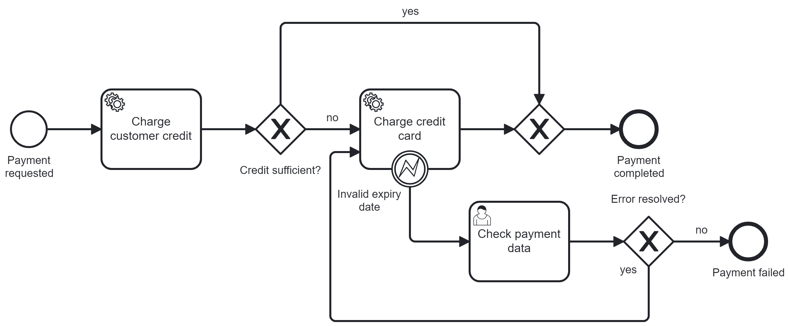

# Camunda 8 - Spring Boot - Kotlin Template - Payment Example Process Application

This is an example of a process application containing a payment process and the
required workers, forms and dummy services.

You can use the image that is build from this spring boot application to have
first running example in your Self-managed installation of a Camunda 8 cluster.


## Features

- Auto deployment of the BPMN file when the application starts.
- Form to start process instances manually
- REST Api to start process instance (scripted by yourself)
- Workers with business logic included


## Build the image

```
mvn clean spring-boot:build-image
```

Requirements: Docker daemon on the build computer
(https://docs.spring.io/spring-boot/docs/current/maven-plugin/reference/htmlsingle/#build-image).

## Configuration

As the image contains the Spring-Zeebe client, you can configure all required
connection properties as described here:
https://github.com/camunda-community-hub/spring-zeebe#configuring-camunda-platform-8-saas-connection.
Spring Boot offers configuration over environment variables:
https://docs.spring.io/spring-boot/docs/current/reference/html/features.html#features.external-config

The application.yaml, that is included in the image, contains values for local
development.

```
zeebe.client.broker.gateway-address=localhost:26500
zeebe.client.security.plaintext=true
```

Maybe you have to override the values in your cluster.

## Using a Camunda 8 SaaS cluster

If you want to connect the container to a Camunda 8 cloud cluster, the docker
command looks like this:

```
docker run -e ZEEBE_CLIENT_CLOUD_CLUSTERID -e ZEEBE_CLIENT_CLOUD_CLIENTID -e ZEEBE_CLIENT_CLOUD_CLIENTSECRET -e ZEEBE_CLIENT_CLOUD_REGION -e ZEEBE_CLIENT_SECURITY_PLAINTEXT -p 8080:8080 --name template-spring-kotlin-camunda template-spring-kotlin-camunda:8.4.0
```

The environment variables were set in the shell before.


## Using a Camunda 8 in Docker Local

If you want to connect to a Camunda 8 local cluster, the docker
command looks like this:

```
docker-compose up -d
```

## Running

The application exposes a webserver on port 8080 with an HTML page containing a
form to request a payment.

Conventions for this application:

- The customer ID should end with a number (cust45). The number is the credit
  that the customer already has with the company.
- If the customer credit is higher than the order total, there is no additional
  credit card charge required.
- If the customer credit is not sufficient to cover the order total, the
  remaining amount is charged from the credit card.
- If the credit card expired or has an invalid expiry date, a user has to decide
  via Tasklist, if the payment error can be resolved or not.

You can start a process instance with REST call as well:

```
curl -L "http://localhost:8080/start" -X "POST" -H "Content-Type: application/json" -d "{\"customerId\": \"cust50\", \"orderTotal\": 67.50, \"cardNumber\": \"1234 4567\", \"cvc\": \"123\", \"expiryDate\": \"12/24\"}"
```
## BPMN Model




## Access Camunda 8 - Applications

Camunda 8 Local installation Links:

- Identity: http://localhost:8084
- Keycloak: http://localhost:18080
- Tasklist: http://localhost:8082
- Operate:  http://localhost:8081
- Optimize: http://localhost:8083
- Elasticsearch: http://localhost:9200
- Kibana: http://localhost:5601

## Interaction with business logic

The application writes the interaction of process instances with the business
logic into the container log. There you can find output like this:

```
Handling customer credit for process instance 2251799813720515
customer cust50 has credit of 50.0
charged 50.0 from the credit, open amount is 17.5
Handling credit card payment for process instance 2251799813720515
charging card 1234 4567 that expires on 12/24 and has cvc 123 with amount of 17.5
payment completed
```
## Gradle Detekt 

The application has integration with Gradle Detekt Plugin, Detekt helps to write cleaner 
Kotlin code.

```
gradle detekt
```

## Stacks
<p style= "text-align: left;">
  
  


</p>
